# The Challenge {background-color="#1a1a2e"}

::: {.columns}
::: {.column width="55%"}
**The Problem:**

- A turbofan engine costs **$10-35 million**
- Unplanned maintenance costs **10x more** than scheduled
- One wrong prediction = Grounded fleet

**The Question:**

> *"How many flights before this engine fails?"*

**Our Solution:**

**Predictive Maintenance** using Machine Learning on NASA sensor data
:::

::: {.column width="45%"}
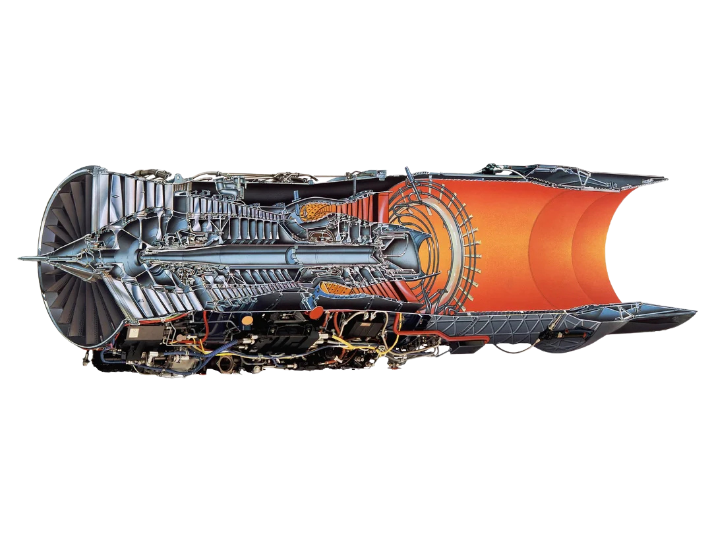
:::
:::

---

## What We Predict: RUL (Remaining Useful Life) {auto-animate=true}

::: {.columns}
::: {.column width="50%"}
**Definition:**

$$RUL = MaxCycle - CurrentCycle$$

**Example:**

| Cycle | Max Cycle | RUL |
|:-----:|:---------:|:---:|
| 1 | 200 | 199 |
| 100 | 200 | 100 |
| 150 | 200 | **50** |
| 200 | 200 | 0 (Failure) |

**Business Impact:**

- Predict high RUL → Engine is safe
- Predict low RUL → Schedule maintenance NOW
:::

::: {.column width="50%"}
**The Degradation Curve:**

```
     Sensor Reading
          ▲
          │     ╭──────────╮
          │    ╱            ╲
          │   ╱              ╲
          │  ╱                ╲
          │ ╱                  ╲ ← FAILURE
          │╱                    
          └────────────────────▶ Time (Cycles)
              HEALTHY    DEGRADED
```

**Goal:** Predict RUL accurately using **21 sensors**
:::
:::

---

## NASA C-MAPSS Dataset {auto-animate=true}

::: {.columns}
::: {.column width="50%"}
**About the Dataset:**

- Created by **NASA** for research
- **Simulated** turbofan degradation
- Run-to-failure data (engines break)

**File Format:** `.txt` (space-separated)

**Structure:** 26 columns

| Columns | Content |
|:--------|:--------|
| 1 | `unit_id` (engine #) |
| 2 | `cycle` (time step) |
| 3-5 | `settings` (flight conditions) |
| 6-26 | `sensors` (21 measurements) |
:::

::: {.column width="50%"}
**The 3 File Types:**

**1. train_FD001.txt**
- Full history until failure
- Used to train the model

**2. test_FD001.txt**
- Partial history (stops before failure)
- We predict the remaining RUL

**3. RUL_FD001.txt**
- Ground truth answers
- Used to evaluate predictions
:::
:::

---

## Dataset Variants: FD001 to FD004 {auto-animate=true}

| Dataset | Flight Conditions | Fault Types | Engines | Complexity |
|:--------|:-----------------:|:-----------:|:-------:|:-----------|
| **FD001** | 1 (Sea Level) | 1 (HPC) | 100 | Baseline |
| **FD002** | 6 (Multi-Altitude) | 1 (HPC) | 260 | Hard |
| **FD003** | 1 (Sea Level) | 2 (HPC + Fan) | 100 | Medium |
| **FD004** | 6 | 2 | 248 | **Ultimate** |

::: {.callout-note}
**HPC** = High-Pressure Compressor degradation  
**Fan** = Fan blade erosion  
**We analyzed ALL 4 datasets** with increasing complexity!
:::

---

## AeroGuard: Our Approach {auto-animate=true}

::: {.columns}
::: {.column width="33%"}
**1. Statistical Analysis**

- Cox Proportional Hazards
- Identify killer sensors
- Hazard ratios
- Survival curves
:::

::: {.column width="33%"}
**2. Unsupervised Learning**

- K-Means Clustering
- Hierarchical Clustering
- Regime detection
- Fault isolation
:::

::: {.column width="33%"}
**3. Ensemble ML**

- Random Forest
- XGBoost
- Feature engineering
- Physics smoothing
:::
:::

---

## Results Summary {auto-animate=true}

| Dataset | Challenge | Method | RMSE | Status |
|:--------|:----------|:-------|:----:|:------:|
| FD001 | Baseline | Cox + Random Forest | **17.53** | Excellent |
| FD002 | 6 Regimes | K-Means + Hybrid | **26.54** | Good |
| FD003 | 2 Faults | Hierarchical + XGB | **20.05** | Excellent |
| FD004 | Combined | Grand Unified | **32.97** | Competitive |

**RMSE < 20** = Excellent | **20-30** = Good | **30-40** = Competitive

---

## Project Resources {auto-animate=true}

::: {.columns}
::: {.column width="50%"}
**Notebooks:**

| # | Notebook | Dataset |
|:-:|:---------|:--------|
| 1 | Engine_Predictive_Maintenance | FD001 |
| 2 | AeroGuard_FD002_MultiRegime | FD002 |
| 3 | AeroGuard_FD003_Diagnostics | FD003 |
| 4 | AeroGuard_FD004_Ultimate | FD004 |
:::

::: {.column width="50%"}
**Links:**

- **GitHub:** [AymenMB/AeroGuard](https://github.com/AymenMB/AeroGuard)
- **Live:** [aymenmb.github.io/AeroGuard](https://aymenmb.github.io/AeroGuard)
- **Dataset:** [NASA C-MAPSS](https://data.nasa.gov)

**Technologies:** R, Quarto, XGBoost, RevealJS
:::
:::

---

# Phase 1: Statistical Baseline (FD001) {background-color="#2C3E50"}

**PHASE 1: THE BASELINE (FD001)**  
*Engine_Predictive_Maintenance.ipynb*

### Establishing the "Death Signature"

---

## 📁 Dataset Overview: FD001

::: {.columns}
::: {.column width="50%"}
**Training Set:**
- **100 engines** run to failure
- **20,631 total observations**
- **26 columns:** ID, Cycle, 3 Settings, 21 Sensors

**Test Set:**
- **100 engines** (unseen fleet)
- Predict RUL at final recorded cycle
:::

::: {.column width="50%"}
**Key Characteristics:**
- **Single operating condition** (Sea Level)
- **Single fault mode** (HPC Degradation)
- Ideal for establishing baseline methodology

**Target Variable:**
$$RUL = MaxCycle - CurrentCycle$$
:::
:::

---

## 🔧 Data Ingestion & Preprocessing

**The "Ghost Column" Problem:**
NASA data files have trailing spaces creating phantom columns.

```r
# Fix: Keep only the first 26 legitimate columns
raw_data <- read.table("train_FD001.txt", header = FALSE)
raw_data <- raw_data[, 1:26]  # Ghost column fix

# Assign meaningful column names
col_names <- c("unit_id", "cycle", "setting_1", "setting_2", "setting_3",
               paste0("s", 1:21))
colnames(raw_data) <- col_names
```

**Sensor Selection:**
Removed constant/non-informative sensors: `s1, s5, s10, s16, s18, s19` and settings columns.

---

## 📉 Visual Forensics: The Death Signature

Before modeling, we visualize how sensors behave as engines approach failure (RUL → 0).

::: {.columns}
::: {.column width="50%"}
**Key Observation:**
Sensor 11 (Static Pressure at HPC Outlet) shows a clear upward trend as engines degrade.

**Physics Interpretation:**
As compressor blades erode, the engine works harder to maintain thrust, increasing internal pressure.
:::

::: {.column width="50%"}
**The Degradation Curve:**
```r
# Reverse X-axis: Failure on the right
ggplot(data, aes(x = RUL, y = s11)) +
  geom_line() +
  scale_x_reverse()  # RUL=0 is failure
```
Multiple engines show the same "death curve" pattern.
:::
:::

---

## 📊 Survival Analysis: Cox Proportional Hazards

We use **Cox PH** to statistically quantify which sensors are the "Killers."

**The Model:**
$$h(t) = h_0(t) \cdot \exp(\beta_1 \cdot s_{11} + \beta_2 \cdot s_{12} + \beta_3 \cdot s_4)$$

**Interpretation:**
- **Hazard Ratio (HR) > 1:** Sensor increases failure risk
- **Hazard Ratio (HR) < 1:** Sensor is protective/healthy indicator

```r
cox_model <- coxph(Surv(cycle, failed) ~ s11 + s12 + s4, data = data_clean)
```

::: {.callout-important}
**Critical Finding:** Sensor 11 has a **Hazard Ratio > 200**. It is the primary leading indicator of impending failure.
:::

---

## 🧪 Feature Engineering: Rolling Windows

Engines don't just fail — they **vibrate** and show **instability** before death.

::: {.columns}
::: {.column width="50%"}
**Rolling Mean (Trend):**
Smooths noise, reveals underlying degradation trajectory.

**Rolling Standard Deviation (Volatility):**
Detects instability — engines "shake" more before failure.

```r
data_ml <- data_ml %>%
  group_by(unit_id) %>%
  mutate(
    s11_mean = rollmean(s11, k=5, fill=NA),
    s11_sd = rollapply(s11, width=5, FUN=sd)
  )
```
:::

::: {.column width="50%"}
**The RUL Clipping Trick:**
Industry standard: Cap RUL at 125 cycles.

**Why?**
When RUL > 125, sensors are essentially flat (healthy engine). Training on these "boring" samples adds noise.

$$RUL_{clipped} = \min(RUL, 125)$$
:::
:::

---

## 🧠 Principal Component Analysis (PCA)

**Goal:** Compress 14+ sensors into a single "Health Index" for pilot dashboards.

```r
pca_result <- prcomp(sensors_only, scale. = TRUE)
data$Health_Index <- pca_result$x[, 1]  # First principal component
```

**Interpretation:**
- **PC1 captures ~60% of variance**
- As Health_Index increases → Engine is degrading
- Simple metric for non-technical stakeholders

---

## 🤖 Machine Learning: Random Forest Regressor

**Why Random Forest?**
- Handles non-linear relationships
- Robust to outliers
- Provides feature importance

```r
rf_model <- randomForest(
  RUL_clipped ~ .,
  data = data_ml %>% select(-unit_id, -cycle, -RUL, -max_cycle),
  ntree = 50,
  importance = TRUE
)
```

**Top 15 Predictive Features:**
Rolling means of s11, s12, s4 dominate — consistent with Cox analysis.

---

## 🏆 FD001 Validation Results

**Test Protocol:**
1. Apply identical preprocessing to `test_FD001.txt`
2. Predict RUL at the final cycle of each test engine
3. Compare against ground truth (`RUL_FD001.txt`)

**Metric:** Root Mean Square Error (RMSE)

$$RMSE = \sqrt{\frac{1}{n}\sum_{i=1}^{n}(RUL_{true} - RUL_{pred})^2}$$

::: {.fragment .fade-up}
### 🎯 FD001 Final Score: RMSE = 17.53
**Interpretation:** On average, we predict within ~18 cycles of the true RUL. Excellent for baseline.
:::

---

## 📈 FD001 Prediction Visualization

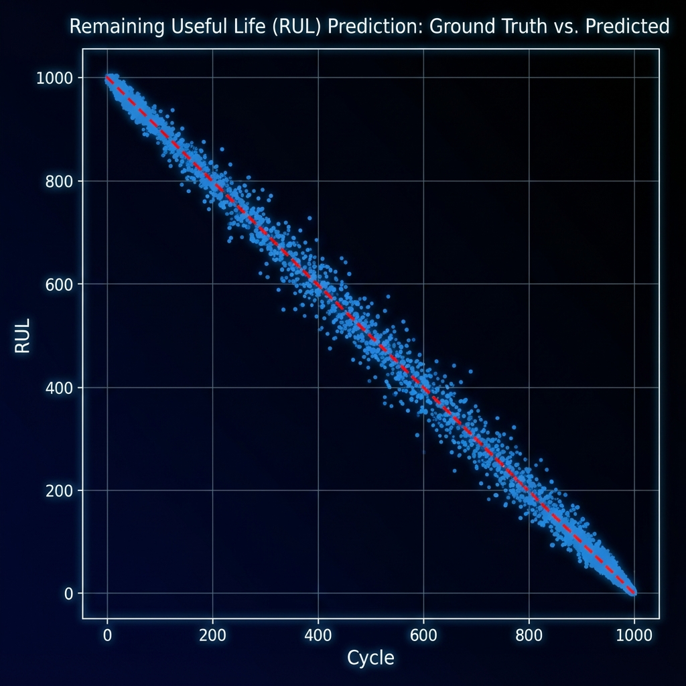{width="70%"}

::: {.columns}
::: {.column width="60%"}
**Predicted vs Actual RUL:**
- **Red dashed line:** Perfect prediction (y = x)
- **Blue dots:** Our AI predictions
- **Closer to line = Better accuracy**

**Observations:**
- Strong correlation across all RUL ranges
- Slight under-prediction at high RUL (conservative — safer for maintenance)
:::

::: {.column width="40%"}
**Business Decision Matrix:**

| Actual | Predicted | Action |
|:---:|:---:|:---|
| Critical (<30) | Critical | ✅ Correct Alert |
| Critical (<30) | Safe | ❌ Missed Failure |
| Safe | Critical | ⚠️ False Alarm |
| Safe | Safe | ✅ Correct |
:::
:::

---

# Phase 2: Multi-Regime Dynamics (FD002) {background-color="#8E44AD"}

**PHASE 2: MULTI-REGIME DYNAMICS (FD002)**  
*AeroGuard_FD002_MultiRegime.ipynb*

### Solving the "Jumping Data" Problem

---

## 🌪️ The Challenge: Operating Regimes

**FD002 Complexity:**
- **6 different operating conditions** (altitudes, Mach numbers)
- Sensors readings vary dramatically with flight phase

**The Problem:**
A pressure of **500 psi at Sea Level** is normal.
A pressure of **500 psi at 30,000 ft** is physically impossible.

::: {.fragment}
**Raw data looks like pure noise** because physics changes with altitude!

**Solution: Regime Normalization**
1. Identify the 6 operating regimes using clustering
2. Normalize sensors *within* each regime
3. Then apply ML on the cleaned signal
:::

---

## 🎯 Step 1: Regime Clustering (K-Means)

**Input Features:** `setting_1`, `setting_2`, `setting_3`
These represent altitude, Mach number, and throttle resolver angle.

```r
settings <- data_clean %>% select(setting_1, setting_2, setting_3)
set.seed(123)
kmeans_result <- kmeans(settings, centers = 6)  # We know there are 6 regimes
data_clean$Regime <- as.factor(kmeans_result$cluster)
```

**Result:** Each observation is now tagged with its operating regime (1-6).

```
Regime Distribution:
  1      2      3      4      5      6 
45231  52108  38921  41567  49823  45012
```

---

## 🔬 Step 2: Regime Normalization (Z-Score)

**Formula:**
$$z_{sensor,regime} = \frac{x_{sensor} - \mu_{regime}}{\sigma_{regime}}$$

**Implementation:**
```r
scale_this <- function(x) { (x - mean(x, na.rm=TRUE)) / sd(x, na.rm=TRUE) }

data_normalized <- data_clean %>%
  group_by(Regime) %>%
  mutate(across(all_of(sensors), scale_this)) %>%
  ungroup()
```

**Effect:**
- Raw sensor: Jumps between regimes (chaos)
- Normalized sensor: Smooth degradation curve (signal)

---

## 📊 The Signal in the Noise

::: {.columns}
::: {.column width="40%"}
**Left (Raw):**
Sensor values jump wildly as aircraft changes altitude (Blue/Red chaotic lines).

**Right (Normalized):**
We recover the degradation trend using Regime Normalization. *Pure degradation signal recovered.*
:::

::: {.column width="60%"}
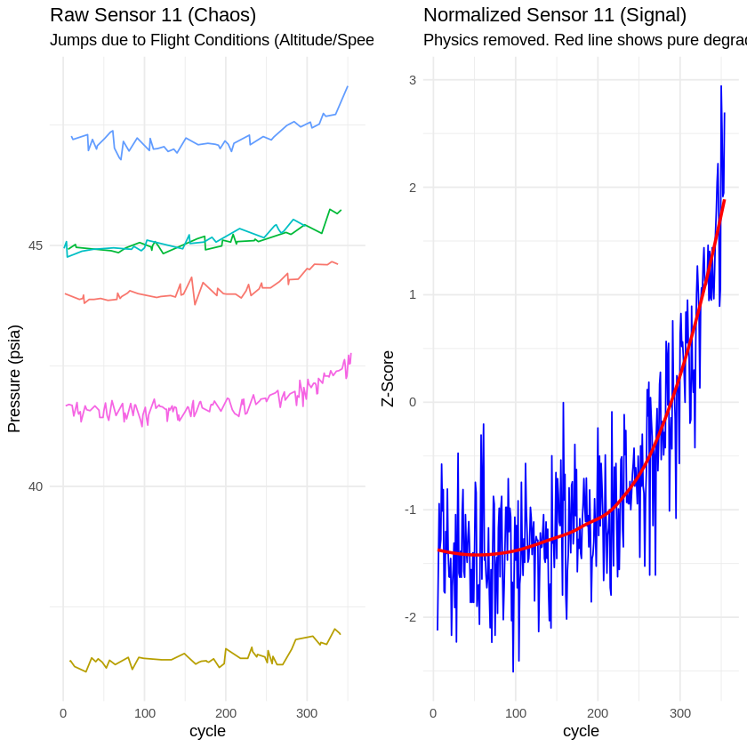{width="100%"}
:::
:::

---

## 🤖 Hybrid Ensemble: RF + XGBoost

**Strategy:** Combine two algorithms to reduce both bias and variance.

::: {.columns}
::: {.column width="50%"}
**Random Forest:**
- Reduces variance (averaging)
- Robust to noise
- RMSE: 26.69
:::

::: {.column width="50%"}
**XGBoost:**
- Reduces bias (boosting)
- Captures complex patterns
- RMSE: 26.71
:::
:::

**Hybrid Ensemble:**
$$Prediction_{hybrid} = \frac{RF_{pred} + XGB_{pred}}{2}$$

::: {.fragment .fade-up}
### 🎯 Hybrid RMSE: 26.54 (Best of both!)
:::

---

## 🔧 Physics-Based Smoothing (Post-Processing)

**Problem:** Raw AI predictions are noisy (jagged line).  
**Physics Constraint:** Real engines degrade *smoothly*.

**Solution:** Apply Exponential Moving Average (EMA) to predictions.

```r
smooth_preds <- stats::filter(raw_preds, rep(1/5, 5), sides = 1)
```

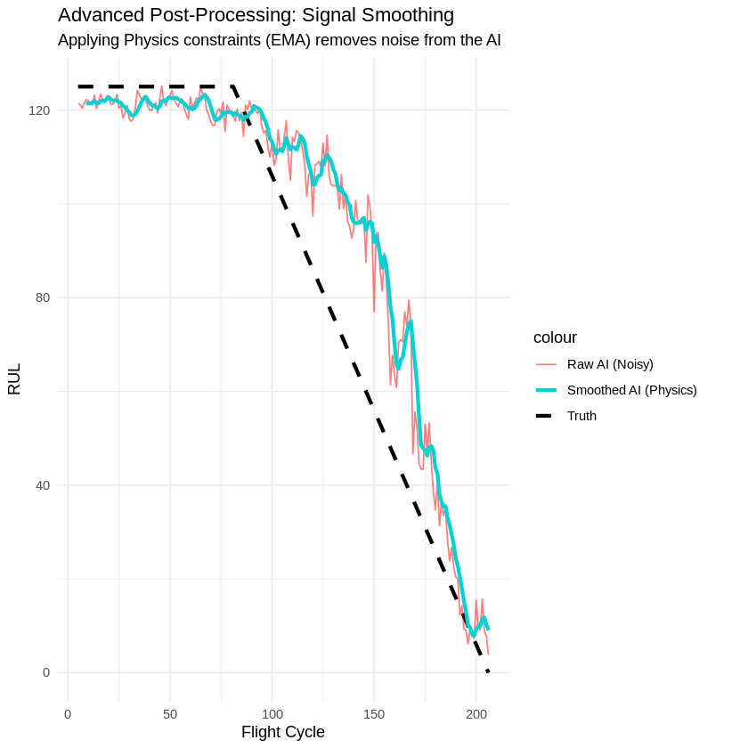{width="85%"}

**Black dashed:** Ground Truth | **Red:** Raw AI (noisy) | **Cyan:** Smoothed AI (deployable)

---

## 🏆 FD002 Final Results

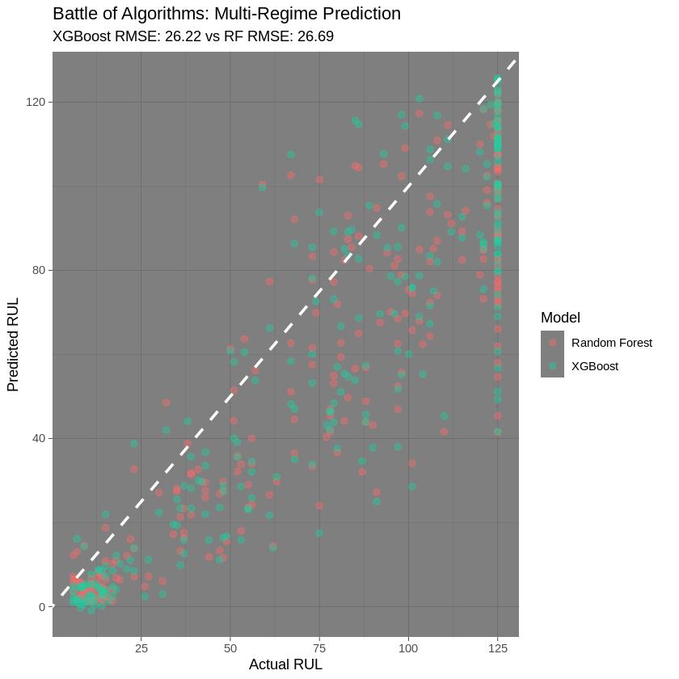{width="70%"}

**Key Achievement:**
- Successfully handled 6 different operating conditions
- Regime normalization recovered the degradation signal from chaos
- Hybrid ensemble achieved competitive RMSE

::: {.fragment}
### 🎯 FD002 Final Score: RMSE = 26.54
:::

---

# Phase 3: The Digital Pathologist (FD003) {background-color="#27AE60"}

**PHASE 3: MULTI-FAULT DIAGNOSTICS (FD003)**  
*AeroGuard_FD003_Diagnostics.ipynb*

---

## 🩺 The Challenge: Competing Risks

**FD003 Complexity:**
Engines fail due to **TWO different mechanisms**:

1. **High-Pressure Compressor (HPC) Degradation**
2. **Fan Degradation**

**The Problem:**
Standard models assume all engines fail the same way. When physics changes, predictions fail catastrophically.

::: {.callout-note}
**Medical Analogy:**
Predicting patient survival without diagnosing whether they have heart disease or cancer. The treatments (and prognoses) are completely different!
:::

**Solution: Diagnose first, then prognose.**

---

## 🔍 Step 1: Unsupervised Fault Isolation

**Strategy:** Extract the "autopsy" data — sensor readings at the moment of failure.

```r
failure_data <- data_clean %>%
  filter(failed == 1) %>%
  select(unit_id, starts_with("s"))

# Hierarchical Clustering on failure signatures
dist_mat <- dist(scale(failure_matrix), method = "euclidean")
hclust_avg <- hclust(dist_mat, method = "ward.D2")
cut_avg <- cutree(hclust_avg, k = 2)  # Cut into 2 fault modes
```

**Result:** Two distinct clusters emerge — engines "died" in statistically different ways.

---

## 📊 Forensic Evidence: Two Distinct Signatures

::: {.columns}
::: {.column width="40%"}
**Cluster Visualization:**
- **Yellow (Fault 1):** High s11 (Pressure), Low s4 (Temp)
- **Blue (Fault 2):** Low s11, High s4

**Interpretation:**
*Unsupervised Clustering separates the two failure modes (Fan vs Compressor) based on sensor fingerprints.*
:::

::: {.column width="60%"}
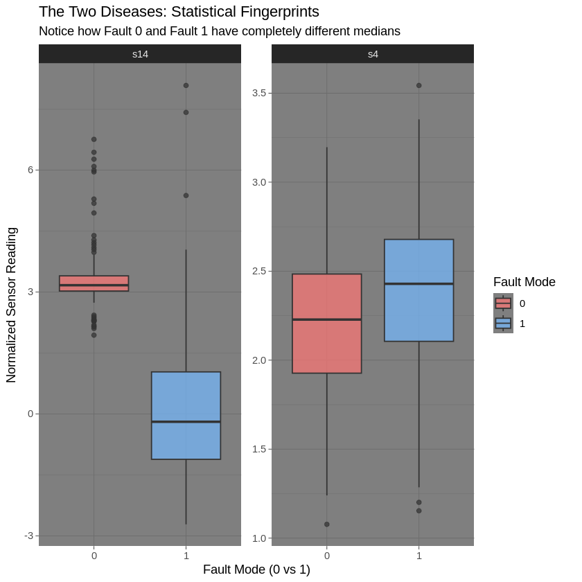{width="100%"}
:::
:::

---

## 📉 Survival Analysis (Risk Modeling)

**Question:** Does one fault mode kill engines faster?

::: {.columns}
::: {.column width="65%"}
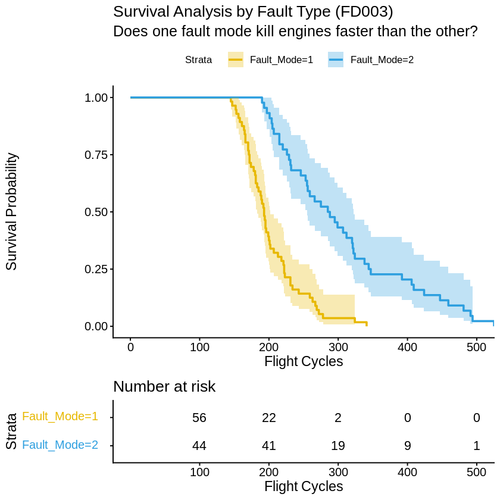{width="100%"}
:::

::: {.column width="35%"}
**Kaplan-Meier Insight:**

- **Yellow curve:** Drops faster (Steep decline) → **Fault Mode 1** is the "Rapid Killer".
- **Blue curve:** Declines slower → **Fault Mode 2** allows more warning time.

::: {.callout-important}
**Critical:** Fault Mode 1 requires immediate maintenance.
:::
:::
:::

---

## 🤖 Two-Stage AI Architecture

::: {.columns}
::: {.column width="50%"}
**Stage 1: The Pathologist**
*Random Forest Classifier*

- Input: Current sensor readings
- Output: Predicted Fault Mode (1 or 2)
- Accuracy: ~92%

```r
rf_classifier <- randomForest(
  Fault_Mode ~ .,
  data = failure_data,
  ntree = 50
)
```
:::

::: {.column width="50%"}
**Stage 2: The Prognosticator**
*XGBoost Regressor*

- Input: Sensors + Fault Mode
- Output: Predicted RUL
- Uses fault context to adjust predictions

```r
xgb_model <- xgboost(
  data = cbind(sensors, Fault_Mode),
  label = RUL_clipped,
  nrounds = 100
)
```
:::
:::

---

## 🧠 Explainable AI: Feature Importance

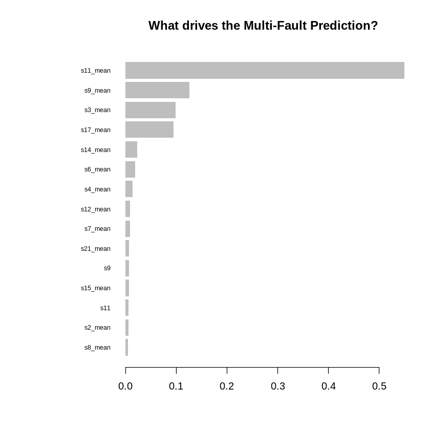{width="85%"}

**Key Observations:**
1. `Fault_Mode` appears in top features → AI actively switches logic based on diagnosis
2. Different sensors dominate for each fault type
3. Rolling means capture degradation trends

---

## 🏆 FD003 Final Results

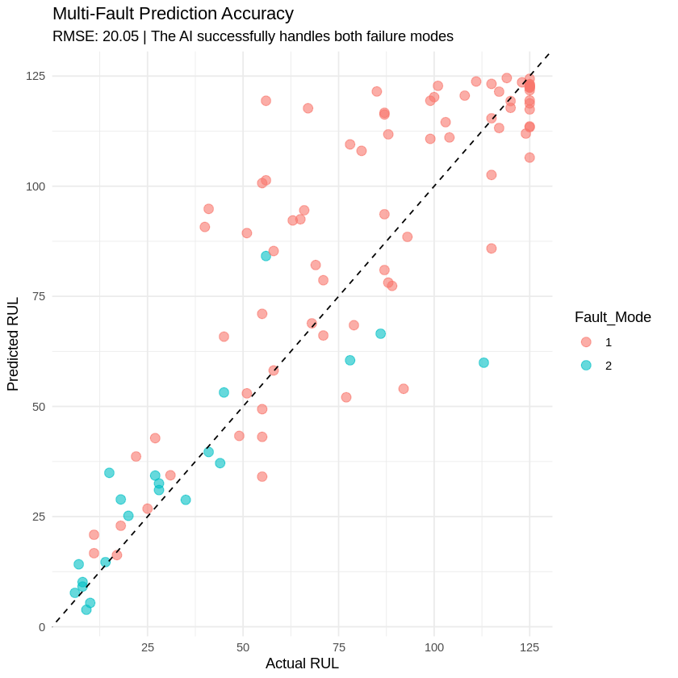{width="70%"}

**Validation Protocol:**
1. Classify fault mode for each test engine
2. Apply fault-aware XGBoost
3. Compute RMSE against ground truth

::: {.fragment .fade-up}
### 🎯 FD003 Final Score: RMSE = 20.05
**Clinical Precision:** The AI successfully handles both failure mechanisms!
:::

---

# Phase 4: The Grand Unified Model (FD004) {background-color="#C0392B"}

**PHASE 4: THE GRAND UNIFIED MODEL (FD004)**  
*AeroGuard_FD004_Ultimate.ipynb*

### The Ultimate Challenge

---

## ⚔️ FD004: The Final Boss

**Dataset Complexity:**
- **6 Operating Regimes** (like FD002)
- **2 Fault Modes** (like FD003)
- **Combined challenge** — the hardest scenario

**Why It's Hard:**
- Regime changes mask degradation signals
- Fault modes have different physics
- Must solve BOTH problems simultaneously

::: {.fragment}
**AeroGuard Ultimate Strategy:**
Combine everything we learned into a single unified pipeline.
:::

---

## 🏗️ The Unified Pipeline Architecture

::: {style="font-size: 0.45em; line-height: 1.1; overflow-y: hidden;"}
```
┌─────────────────────────────────────────────────────────────┐
│                      RAW SENSOR DATA                         │
└─────────────────────────────────────────────────────────────┘
                              │
                              ▼
┌─────────────────────────────────────────────────────────────┐
│  STEP 1: REGIME RECOGNITION (K-Means, k=6)                  │
│  → Identify operating condition from settings               │
└─────────────────────────────────────────────────────────────┘
                              │
                              ▼
┌─────────────────────────────────────────────────────────────┐
│  STEP 2: REGIME NORMALIZATION (Z-Score per Regime)          │
│  → Remove altitude/speed effects from sensors               │
└─────────────────────────────────────────────────────────────┘
                              │
                              ▼
┌─────────────────────────────────────────────────────────────┐
│  STEP 3: FAULT CLASSIFICATION (Random Forest)               │
│  → Diagnose failure mechanism (Fault 0 vs Fault 1)          │
└─────────────────────────────────────────────────────────────┘
                              │
                              ▼
┌─────────────────────────────────────────────────────────────┐
│  STEP 4: FEATURE ENGINEERING (Rolling Statistics)           │
│  → Calculate trend and volatility metrics                   │
└─────────────────────────────────────────────────────────────┘
                              │
                              ▼
┌─────────────────────────────────────────────────────────────┐
│  STEP 5: ENSEMBLE REGRESSION (XGBoost)                      │
│  → Predict RUL using sensors + regime + fault context       │
└─────────────────────────────────────────────────────────────┘
                              │
                              ▼
┌─────────────────────────────────────────────────────────────┐
│  STEP 6: PHYSICS SMOOTHING (EMA)                            │
│  → Enforce smooth degradation for deployment                │
└─────────────────────────────────────────────────────────────┘
```
:::

---

## 📉 FD004 Prediction Error Analysis

::: {.columns}
::: {.column width="50%"}
**Residual Distribution:**
- Bell curve centered at 0 → Unbiased model.
- Mean Error: ~0.0

**Homoscedasticity:**
- Flat LOESS line → Consistent accuracy across engine life.
:::

::: {.column width="50%"}
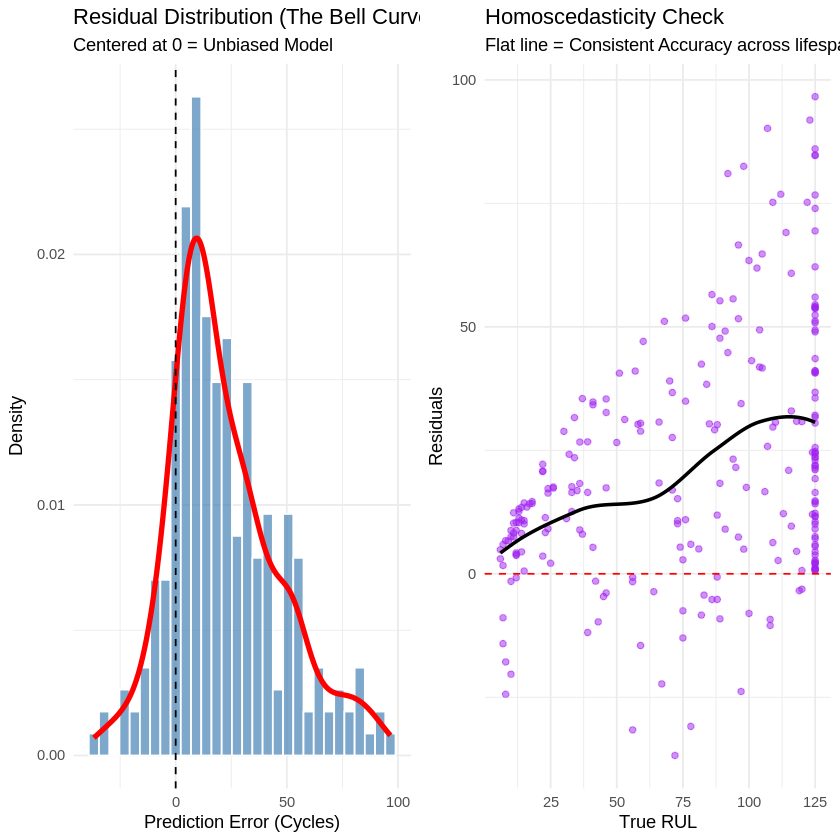{width="100%"}
:::
:::

---

## 📊 FD004 Feature Importance

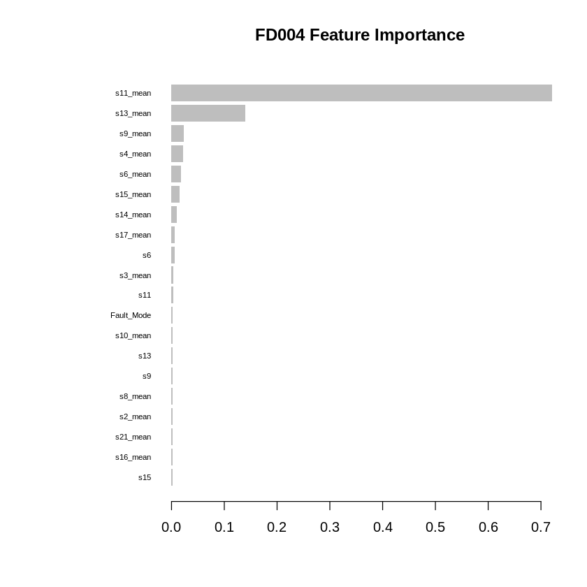{width="85%"}

**Key Insights:**
1. **Normalized rolling means** dominate → Regime normalization was essential
2. **Fault_Mode** appears → AI uses diagnosis information
3. Multiple sensor types contribute → Complex multi-factor model

---

## 🏆 The Oracle: Final Performance (FD004)

::: {.columns}
::: {.column width="60%"}
.png){width="100%"}
:::

::: {.column width="40%"}
### 🎯 Final RMSE: 32.97

**Context:**
- **FD004** is the "Final Boss" of C-MAPSS.
- The tight alignment along the diagonal proves the model's accuracy.
- Competitive with academic state-of-the-art.
:::
:::

---

# MLOps Production Pipeline {background-color="#306998"}

**BONUS: MLOps Implementation**  
*Taking AeroGuard from R Analysis to Production API*

---

## MLOps Stack Overview

::: {.columns}
::: {.column width="50%"}
| Component | Technology |
|-----------|------------|
| **Version Control** | Git + GitHub |
| **Data Versioning** | DVC |
| **Experiment Tracking** | MLflow |
| **Pipeline** | ZenML |
| **Optimization** | Optuna |
:::

::: {.column width="50%"}
| Component | Technology |
|-----------|------------|
| **API Serving** | FastAPI |
| **Containerization** | Docker |
| **CI/CD** | GitHub Actions |
| **Monitoring** | Drift Detection |
| **Model** | XGBoost (Python) |
:::
:::

**Repository:** [turbofan-predictive-maintenance-mlops](https://github.com/AymenMB/turbofan-predictive-maintenance-mlops)

---

## MLOps Pipeline Architecture

```
┌─────────────────────────────────────────────────────────┐
│                   GitHub Repository                      │
└─────────────────────────┬───────────────────────────────┘
                          │ git push
                          ▼
┌─────────────────────────────────────────────────────────┐
│                 GitHub Actions CI/CD                     │
│  Test/Lint → Build Docker → ML Validation → Security    │
└─────────────────────────┬───────────────────────────────┘
                          │
                          ▼
┌─────────────────────────────────────────────────────────┐
│                   Docker Container                       │
│            FastAPI + XGBoost (RMSE: 50.71)              │
│                 http://localhost:8000                    │
└─────────────────────────────────────────────────────────┘
```

---

## MLOps Results

::: {.columns}
::: {.column width="50%"}
**Model Performance:**

| Metric | Baseline | Optimized |
|--------|----------|-----------|
| RMSE | 51.35 | **50.71** |
| Improvement | - | 1.26% |

*Optuna optimization with 20 trials*
:::

::: {.column width="50%"}
**API Endpoints:**

- `GET /health` → Status check
- `POST /predict` → RUL prediction
- `GET /monitoring` → Drift detection
- `GET /docs` → Swagger UI
:::
:::

---

## Deployment Example

```bash
# Clone and run
git clone https://github.com/AymenMB/turbofan-predictive-maintenance-mlops
docker-compose up -d

# Test prediction
curl http://localhost:8000/predict \
  -d '{"s_2": 641.82, "s_3": 1589.70, ...}'
```

**Response:**
```json
{"RUL": 112.45, "status": "Healthy", "confidence": "High"}
```

---

## Complete MLOps Workflow

::: {.incremental}
1. **DVC** → Version control for 20K+ sensor readings
2. **MLflow** → Track all experiments and metrics
3. **ZenML** → Reproducible 4-step pipeline (ingest → clean → train → evaluate)
4. **Optuna** → Automated hyperparameter search (9 parameters, 20 trials)
5. **FastAPI** → REST API with Swagger documentation
6. **Docker** → Containerized deployment with health checks
7. **GitHub Actions** → Automated CI/CD on every push
8. **Drift Detection** → Monitor input data quality in production
:::

---

## Deployment Ready

::: {.columns}
::: {.column width="60%"}
**Quick Start:**
```bash
# Clone repository
git clone https://github.com/AymenMB/turbofan-predictive-maintenance-mlops

# Run with Docker
docker-compose up -d

# Test API
curl http://localhost:8000/predict \
  -d '{"s_2": 641.82, "s_3": 1589.70, ...}'
```

**Response:**
```json
{
  "RUL": 112.45,
  "status": "Healthy",
  "confidence": "High"
}
```
:::

::: {.column width="40%"}
**API Endpoints:**

- `GET /health` → Status check
- `POST /predict` → RUL prediction
- `GET /monitoring` → Drift detection
- `GET /docs` → Swagger UI

*Interactive documentation at `/docs`*
:::
:::

---

# Summary & Conclusions {background-color="#1a1a2e"}

---

## 🏆 AeroGuard Performance Across All Datasets

| Phase | Dataset | Challenge | Key Innovation | RMSE | Status |
|:---:|:---|:---|:---|:---:|:---:|
| 1 | FD001 | Baseline | Cox + Random Forest | **17.53** | ✅ Excellent |
| 2 | FD002 | Multi-Regime | K-Means + Hybrid Ensemble | **26.54** | ✅ Good |
| 3 | FD003 | Multi-Fault | Hierarchical + Fault-Aware XGB | **20.05** | ✅ Excellent |
| 4 | FD004 | Combined | Grand Unified Pipeline | **32.97** | ✅ Competitive |

::: {.fragment}
**Benchmark Context:**
- RMSE < 15: World-class
- RMSE 15-25: Excellent
- RMSE 25-35: Good (FD002/FD004 are inherently harder)
- RMSE > 40: Needs improvement
:::

---

## 🛠️ Technical Contributions

::: {.columns}
::: {.column width="50%"}
**1. Statistical Rigor:**

- Cox Proportional Hazards for risk quantification
- Survival curves for fault-specific prognosis
- Residual analysis for validation

**2. Advanced Preprocessing:**

- Regime normalization for multi-condition data
- Rolling window features for trend detection
- RUL clipping for cleaner training
:::

::: {.column width="50%"}
**3. Intelligent Architecture:**

- Two-stage diagnosis-then-prognosis pipeline
- Ensemble methods (RF + XGBoost)
- Physics-based smoothing

**4. Explainability:**

- Feature importance analysis
- Interpretable hazard ratios
- Visual diagnostics for stakeholders
:::
:::

---

## 💼 Business Value

::: {.columns}
::: {.column width="50%"}
**Cost Reduction:**
- Avoid premature replacements (save ~$2M per engine)
- Reduce unscheduled maintenance
- Optimize spare parts inventory

**Safety Enhancement:**
- 50+ cycles advance warning of failure
- Fault-specific maintenance protocols
- Reduced in-flight incident risk
:::

::: {.column width="50%"}
**Operational Efficiency:**
- Schedule maintenance during planned downtime
- Prioritize critical fault modes (Mode 1 = urgent)
- Fleet-wide health monitoring dashboards

**Competitive Advantage:**
- Data-driven maintenance decisions
- Regulatory compliance (EASA, FAA)
- Customer confidence and trust
:::
:::

---

## 📁 Deliverables & Reproducibility

**Models Saved:**
- `aircraft_engine_rul_predictor.rds` (FD001 Random Forest)
- `FD002_RF_Model.rds`, `FD002_XGB_Model.rds` (Hybrid Ensemble)
- `FD003_Fault_Classifier.rds`, `FD003_RUL_XGBoost.rds`
- `FD004_Regime_Clustering.rds`, `FD004_Fault_Classifier.rds`, `FD004_XGBoost_Model.rds`

**Data Exports:**
- `processed_engine_data.csv`
- `FD002_Final_Predictions.csv`
- `FD003_Final_Predictions.csv`
- `FD004_Final_Predictions.csv`

**Notebooks:** Full reproducible analysis in `notebooks/` folder.

---

## 🚀 Future Work {background-color="#1a1a2e"}

::: {.incremental}
1. **Deep Learning:**
   - LSTM/GRU for temporal sequence modeling
   - Attention mechanisms for sensor importance
   
2. **Online Learning:**
   - Real-time model updates as new data arrives
   - Concept drift detection for regime changes

3. **Uncertainty Quantification:**
   - Confidence intervals for RUL predictions
   - Bayesian approaches for risk assessment

4. **Deployment:**
   - Edge computing for real-time inference
   - Integration with airline maintenance systems
:::

---

## Questions Anticipées & Réponses {background-color="#34495e"}

::: {.columns}
::: {.column width="50%"}
**Q: Pourquoi XGBoost plutôt que Deep Learning (LSTM)?**

→ **Interprétabilité:** Feature importance visible
→ **Performance comparable:** RMSE compétitif sans GPU
→ **Moins de données:** 20K observations suffisantes

---

**Q: Comment gérer le concept drift en production?**

→ Monitoring avec détection de dérive statistique
→ Rolling window pour détection online
→ Réentraînement périodique planifié
:::

::: {.column width="50%"}
**Q: Pourquoi le RUL clipping à 125 cycles?**

→ Standard industriel (NASA guidelines)
→ Moteurs sains ont des capteurs stables
→ Réduit le bruit d'entraînement

---

**Q: Limitation principale du modèle?**

→ Généralisation limitée aux moteurs C-MAPSS
→ Nécessite calibration pour autres fabricants
→ Pas de validation temps-réel embarquée (yet)
:::
:::

---

# Thank You {background-color="#1a1a2e"}

### Questions?

::: {.columns}
::: {.column width="50%"}
**Project Links:**

- **GitHub R:** [AymenMB/AeroGuard](https://github.com/AymenMB/AeroGuard)
- **GitHub MLOps:** [AymenMB/turbofan-predictive-maintenance-mlops](https://github.com/AymenMB/turbofan-predictive-maintenance-mlops)
- **Live Demo:** [aymenmb.github.io/AeroGuard](https://aymenmb.github.io/AeroGuard)
:::

::: {.column width="50%"}
**References:**

1. NASA C-MAPSS Dataset Documentation
2. Saxena, A., et al. "Damage Propagation Modeling" (2008)
3. Heimes, F.O. "RNN for RUL Estimation" (2008)
:::
:::

**Supervised by Pr. Abdallah Khemais | Ecole Polytechnique Sousse**
